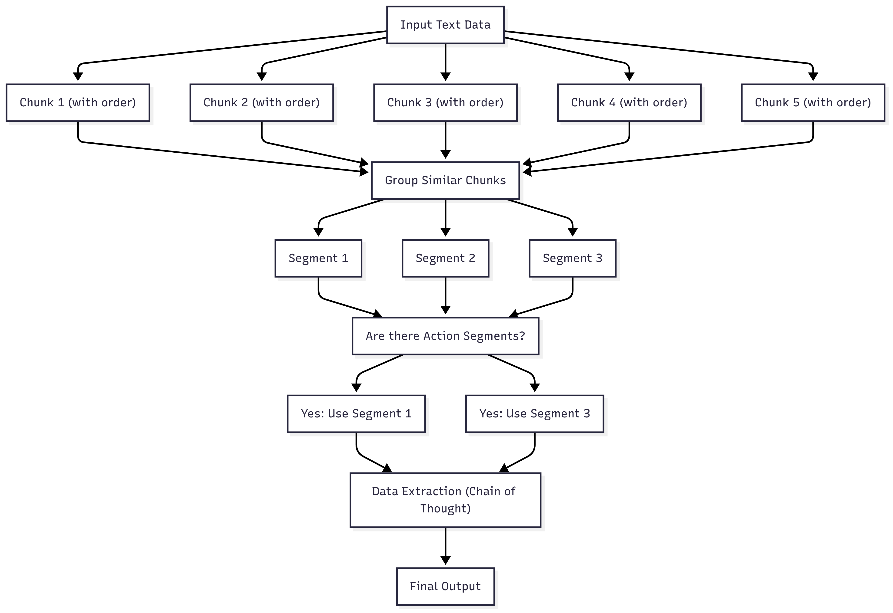

**An AI-powered tool to extract and prioritize action items from meeting transcripts using advanced natural language processing techniques.**

---

## Table of Contents

- [Quick Start](#quick-start)
- [System Architecture](#system-architecture)
   - [Initial Design](#initial-design)
   - [Implemented Design](#implemented-design)
- [Design Justifications](#design-justifications)
  - [Design Patterns](#design-patterns)
  - [Modular Design](#modular-design)
- [Future Improvements](#future-improvements)

---

## Quick Start

```bash
git clone https://github.com/BALK-03/Transcript-Analyzer.git
cd Transcript-Analyzer
```

To use OpenAI instead of Gemini models, open `config.py` and update the configuration:

```python
MODEL_TYPE = "openai"
MODEL_NAME = "your specific model"
API_KEY_ENV_VAR = "OPENAI_API_KEY"
```

Then, launch the application:

```bash
chmod +x ./launch_app.sh
./launch_app.sh
```

After launching, visit the local UI URL shown in your terminal to access the Gradio interface.

To clean up resources after use:

```bash
./cleanup.sh
```

**Note:** On non-Linux systems, adjust the commands accordingly.

---

## System Architecture

### Initial Design

1. **Chunking:**
   Raw transcripts are divided into ordered chunks to address the limited context window of large language models.

2. **Clustering:**
   Chunks are grouped into segments based on similarity and context. While the ideal approach would use embeddings and an unsupervised clustering model, an LLM-based method was used to accelerate development and improve results within project constraints.

3. **Action Filtering:**
   Segments are filtered to retain only those containing actionable content. In a longer timeline, a fine-tuned classifier (e.g., BERT) would have been used.

4. **Data Extraction (Chain of Thought):**
   Relevant action items are extracted using prompt-based reasoning (CoT) to improve reliability and reduce hallucinations.

5. **Quality Check & Validation:**
   Basic validation ensures action items are realistic—e.g., checking if deadlines are plausible and assignees match actual meeting participants.

<p align="center">
  
</p>

### Implemented Design

Due to time constraints, not all optimizations were implemented. The focus was on building a fully functional end-to-end system that could be iterated on later for performance and efficiency improvements.

<p align="center">
  
</p>

---

## Design Justifications

### Design Patterns

The strategic and factory design patterns were chosen specifically to minimize the effort required to extend the project with new models. This architectural decision ensures the lowest amount of code changes needed when integrating additional AI models or services.

### Modular Design

The codebase is built with a clear separation of concerns, allowing individual components to be tested, improved, or swapped out with ease.

---

## Future Improvements

* **Advanced Quality Checks:**
  Implement statistical quality thresholds (e.g., expected length of action items) to validate chunk clustering and extraction logic in production.

* **Clustering Step:**
   Build and train an unsupervised clustering model with text embeddings to cluster data into segments, based on the context, reducing costs and latency.

* **Action Filtering:**
   Built and train a sentiment classification model to classify text as contains action or not. reducing costs and latency.

Enjoy ^^