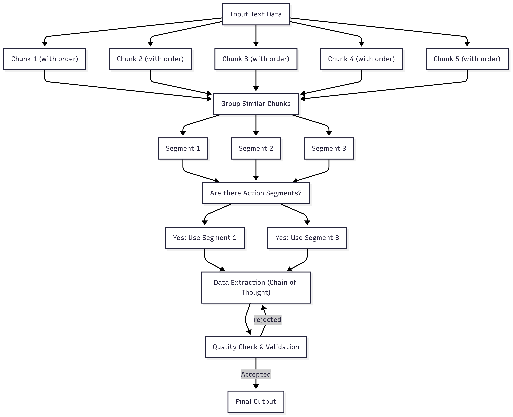

**An AI-powered tool to extract and prioritize action items from meeting transcripts using advanced natural language processing techniques.**


## Table of Contents

- [Quick Start](#quick-start)
- [System Design](#system-design)
- [Design Justifications](#design-justifications)
  - [Design Patterns](#design-patterns)
  - [Modular Design](#modular-design)
- [Future Improvements](#future-improvements)

---

## Quick Start

#### Clone the Repository
```bash
git clone https://github.com/BALK-03/Transcript-Analyzer.git
cd Transcript-Analyzer
```

#### Use OpenAI Model (Optional)

If you want to use an **OpenAI model** for processing:

* Open `config.py` and update the model configuration:

```python
MODEL_TYPE = "openai"
MODEL_NAME = "gpt-4o"  # Or any other OpenAI model
API_KEY_ENV_VAR = "OPENAI_API_KEY"
```

#### Create a .env file
Create a `.env` file inside the `config/` directory and add your API key.
You can use `config/.env_template` as a reference.


#### Launch the app

```bash
chmod +x ./launch_app.sh
./launch_app.sh
```

Once running, check your terminal for the **local Gradio UI URL** and open it in your browser.

#### Clean Up After Use

```bash
./cleanup.sh
```


> **Note:** If you're on macOS or Windows, adjust file permissions or scripts as needed.


---

## System Design

1. **Chunking:**
   Raw transcripts are divided into ordered chunks to address the limited context window of large language models.

2. **Clustering:**
   Chunks are grouped into segments based on similarity and context. While the ideal approach would use embeddings and an unsupervised clustering model, an LLM-based method was used to accelerate development and improve results within project constraints.

3. **Action Filtering:**
   Segments are filtered to retain only those containing actionable content. In a longer timeline, a fine-tuned classifier (e.g., BERT) would have been used.

4. **Data Extraction (Chain of Thought):**
   Relevant action items are extracted using prompt-based reasoning (CoT) to improve reliability and reduce hallucinations.

5. **Quality Check & Validation:**
   Basic validation ensures that action items are realistic, for example, by checking whether deadlines are plausible and whether assignees match actual meeting participants. Given the timeline, this step has not been implemented.
   
<p align="center">
  
</p>


## Design Justifications

### Design Patterns

The strategic and factory design patterns were chosen specifically to minimize the effort required to extend the project with new models. This architectural decision ensures the lowest amount of code changes needed when integrating additional AI models or services.

### Modular Design

The codebase is built with a clear separation of concerns, allowing individual components to be tested, improved, or swapped out with ease.

---

## Future Improvements

* **Advanced Quality Checks:**
  Implement statistical quality thresholds (e.g., expected length of action items) to validate chunk clustering and extraction logic in production.

* **Clustering Step:**
   Build and train an unsupervised clustering model with text embeddings to cluster data into segments, based on the context, reducing costs and latency.

* **Action Filtering:**
   Built and train a sentiment classification model to classify text as contains action or not. reducing costs and latency.

Enjoy ^^