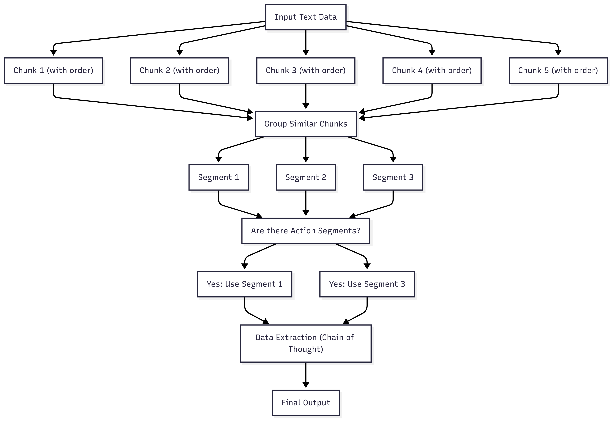

## Table of Contents
- [About The Project](#about-the-project)
- [System Design](#system-design)
- [Getting Started](#getting-started)
- [Usage](#usage)
- [API Endpoints](#api-endpoints)
- [License](#license)


## About The Project
Tired of manually taking notes during meetings? This project automates the process of identifying actionable items from a transcript, saving you time and ensuring no action is missed.


## System Design
The pipeline processes the transcript through a series of steps to ensure accurate and reliable extraction.
* **Chunking:** Raw transcripts are split into smaller, manageable pieces to fit within the language model's context window.
* **Clustering:** Similar content is grouped together to handle repeated discussions or actions.
* **Action Filtering:** Non-actionable segments are filtered out early to improve efficiency.
* **Extraction (Chain of Thought):** Action items are precisely extracted using a reliable, prompt-based reasoning approach.

<p align="center">
  
</p>


## Getting Started
This section will guide you through the process of setting up and running the project using Docker. 

### Installation
1.  Clone the repository.

2.  Build the Docker image:
    ```bash
    sudo docker build -t your-image-name path-to-dockerfile
    ```
3.  Run the container with your API key:
    ```bash
    sudo docker run -p 8000:8000 --name your-container-name -e GEMINI_API_KEY="your_api_key_here" your-image-name
    ```
    Replace `"your_api_key_here"` with your actual API key.


## Usage
Once the container is running, the API will be accessible on your local machine.

### API Endpoints
Open your browser and navigate to **http://localhost:8000/docs** to access the interactive API documentation provided by FastAPI.

### Example
You can test the API by sending a `POST` request with a transcript in the request body. A sample transcript is available in `examples/transcript.json`.